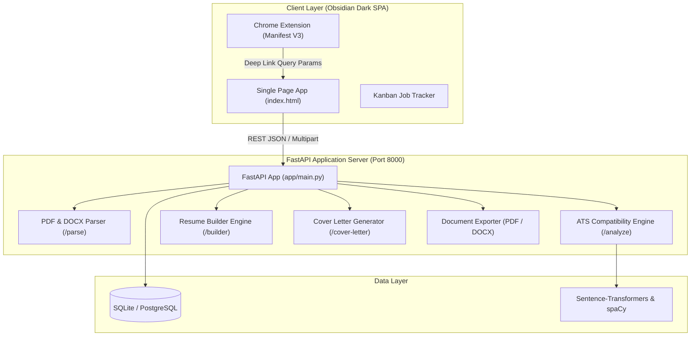

<div align="center">

# 🎯 ResumeGPT
### **Next-Generation AI Resume Analyzer, ATS Booster & Career Intelligence Suite**

<p align="center">
  <a href="https://github.com/yash6810/Resume-GPT/actions"></a>
  <a href="https://github.com/yash6810/Resume-GPT"></a>
  <a href="https://fastapi.tiangolo.com"></a>
  <a href="https://colab.research.google.com/github/yash6810/Resume-GPT/blob/main/notebooks/train_ner_finetune.ipynb"></a>
  <a href="https://render.com"></a>
  <a href="LICENSE"></a>
</p>

<p align="center">
  A 100% privacy-first, open-source alternative to Jobscan ($50/mo), Teal ($29/mo), and Rezi ($29/mo).<br>
  Analyze resumes against job descriptions, calculate live ATS scores, 1-click auto-tailor to target roles, and generate custom cover letters.
</p>

---

<p align="center">
  <a href="#-key-features"><b>Features</b></a> •
  <a href="#-system-architecture"><b>Architecture</b></a> •
  <a href="#-quick-start"><b>Quick Start</b></a> •
  <a href="#-chrome-extension"><b>Chrome Extension</b></a> •
  <a href="#-cloud-gpu-training"><b>Colab GPU Training</b></a> •
  <a href="#-deployment"><b>Deployment</b></a>
</p>

---

</div>

## 🌟 Key Features

### 1. 🎯 1-Click JD Auto-Tailor (Resume Builder)
- Paste any target Job Description (e.g. *Data Scientist* or *Senior Frontend Engineer*).
- **Intelligent Keyword Extraction**: Matches against a structured taxonomy of **100+ industry technical skills**.
- **Instant Alignment**: Rewrites the professional summary, injects missing technical competencies, and drafts quantified, action-verb experience bullets.

### 2. 📊 Real-Time Before & After ATS Score Diff View
- Automatically tracks your baseline ATS score upon first analysis.
- When you 1-click inject missing skills or re-optimize, the **ATS Optimization Diff Card** visualizes:
  - **Score Delta**: e.g., `58% ➔ 92% (+34% ATS Lift)`.
  - **Bridged Keywords**: Highlights exact competencies that transitioned from "missing" to "matched".
  - **Subscore Diagnostics**: Category point gains across Keywords (40%), Role Fit (30%), Experience (20%), and Formatting (10%).

### 3. ✍️ Dedicated AI Cover Letter Studio
- Generate tailored, multi-tone cover letters matched to the company and role.
- Live side-by-side interactive editor with 1-click clipboard copy and **1-click DOCX document download**.

### 4. 📄 ATS-Compliant Document Engine
- Export resumes directly to **DOCX** (`python-docx`) and **PDF** (`fpdf2`).
- Clean typography and structured layouts guaranteed to parse accurately across major ATS platforms (Workday, Taleo, Greenhouse, Lever, iCIMS).

### 5. 📋 Full-Featured Application Kanban Tracker
- Interactive drag-and-drop job application tracker with real-time statistics (Applied, Screening, Interviewing, Offer).
- Hybrid state management: LocalStorage-first with automatic background sync to SQLite backend.

### 6. 🧩 1-Click Chrome Extension (`extension/`)
- Scrapes job postings directly from **LinkedIn, Indeed, Glassdoor, ZipRecruiter, and Greenhouse**.
- **1-Click Bridge**: Click *"🚀 Open in ResumeGPT"* to auto-populate the Analyzer, Builder, and Cover Letter Studio.

---

## 🏛️ System Architecture



---

## ⚡ Quick Start

### 1. Prerequisites
- **Python 3.10+**
- **Node.js 18+** (for test runner)

### 2. Installation

Clone the repository and set up the local virtual environment:

```bash
# Clone the repository
git clone https://github.com/yash6810/Resume-GPT.git
cd Resume-GPT

# Create virtual environment
python -m venv .venv

# Activate virtual environment (Windows PowerShell)
.\.venv\Scripts\activate

# Install dependencies
pip install -r requirements.txt
```

### 3. Launch Server

Run the automated launcher (which auto-binds to your virtual environment):

```bash
python start_server.py
```

Open **`http://localhost:8000`** in your browser.

---

## 🧩 Chrome Extension Setup

1. Open Google Chrome and navigate to **`chrome://extensions/`**.
2. Toggle on **"Developer mode"** in the top right corner.
3. Click **"Load unpacked"** and select the `extension/` directory from this repository.
4. Navigate to any job posting on **LinkedIn** or **Indeed** and click the **ResumeGPT Scanner** icon to scan, analyze, and 1-click bridge into the full studio.

---

## ☁️ Cloud GPU Training (Google Colab)

To preserve local laptop performance (CPU & 8GB RAM), heavy deep learning model training (BERT/RoBERTa NER) is offloaded to Google Colab's free GPU:

[](https://colab.research.google.com/github/yash6810/Resume-GPT/blob/main/notebooks/train_ner_finetune.ipynb)

- **Notebook**: [`notebooks/train_ner_finetune.ipynb`](notebooks/train_ner_finetune.ipynb)
- **Hardware**: Runs seamlessly on Free Google Colab T4/A100 GPUs.
- **Workflow**: Automated dataset preparation &rarr; 3-epoch fine-tuning &rarr; model weight export.

---

## 🧪 Automated Testing

ResumeGPT uses a dual-tier testing architecture:

```bash
# 1. Run Frontend JSDOM Test Suite (21 tests)
cd frontend
npm test

# 2. Run Backend API Contract Suite (13 tests)
cd ../backend
..\.venv\Scripts\python.exe -m pytest tests/test_frontend_contract.py -q

# 3. Full-Stack Unified Audit (34 tests)
python .agents/skills/resumegpt-system-architect/scripts/audit_architecture.py verify
```

**Test Status**: ✨ **34 / 34 Tests Passing (100%)**

---

## 🚀 Cloud Deployment

### 1-Click Deployment to Render.com

[](https://render.com)

1. Connect your GitHub repository on Render.
2. Select **Web Service** and choose **Docker** runtime.
3. Render will automatically build the production image using [`Dockerfile`](Dockerfile) and [`render.yaml`](render.yaml).

### Docker Compose (Local Container)

```bash
docker-compose up --build
```

---

## 💻 Hardware Execution Boundaries

| Workload | Recommended Environment | Specs |
| :--- | :--- | :--- |
| **FastAPI Backend, SQLite, Document Compiler** | 💻 Local Machine | CPU, 8GB RAM |
| **Single-Page UI, ATS Analyzer, Auto-Tailor** | 💻 Local Machine | Modern Browser |
| **Lightweight JSDOM & Contract Test Suites** | 💻 Local Machine | Node.js + Python |
| **BERT / RoBERTa Custom NER Fine-Tuning** | ☁️ Google Colab | Free T4 / A100 GPU |
| **7B+ Parameter LLM Local Inference** | ☁️ Cloud API / Colab | Cloud GPU / Groq API |

---

## 📄 License

This project is licensed under the **MIT License** — see the [LICENSE](LICENSE) file for details.

---

<div align="center">
  <b>Built with precision for job seekers worldwide.</b><br>
  ⭐ <i>Star this repository if you find it helpful!</i>
</div>