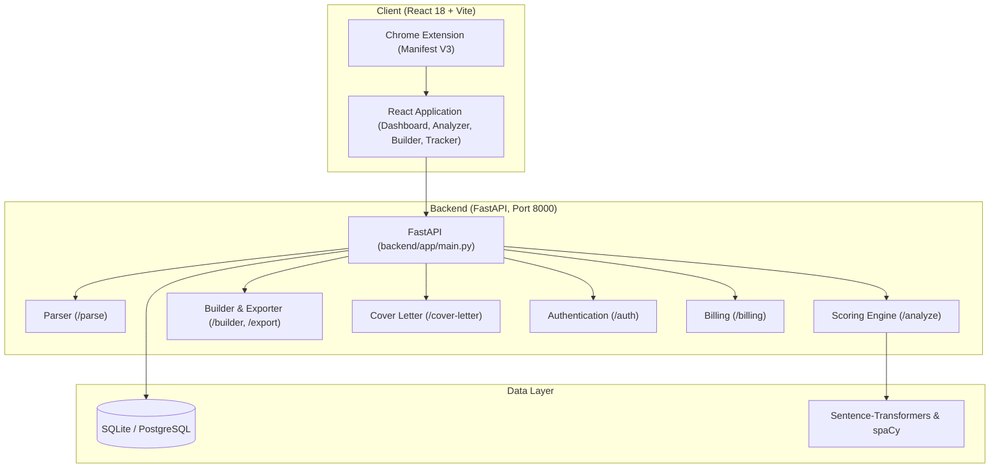

# ResumeGPT

ResumeGPT is an open-source resume optimization platform that analyzes resumes against job descriptions, evaluates ATS compatibility, and formats tailored resumes for submission.

[](https://github.com/yash6810/Resume-GPT/actions)
[](LICENSE)

---

## Overview

ResumeGPT evaluates keyword coverage, role alignment, and document formatting against specific job postings. It provides keyword gap analysis, structured resume editing with live preview, export to DOCX and PDF, and an application pipeline tracker.

---

## Features

- **Resume Analysis**: Compares resume text against job descriptions using keyword matching and semantic similarity to score compatibility across keywords, role relevance, and formatting.
- **Progressive Disclosure Workflow**: Displays high-level screening readiness and top-3 priority fixes upfront, with tabbed access to the full keyword matrix and coaching feedback.
- **STAR Bullet Coaching**: Identifies passive or unquantified bullet points and provides actionable suggestions to structure accomplishments using measurable metrics and strong action verbs.
- **Structured Resume Builder**: Edit contact details, experience, skills, and education with live preview and export to ATS-compliant DOCX (`python-docx`) and PDF (`fpdf2`).
- **Cover Letter Generation**: Creates role-specific cover letter drafts based on resume background and target job requirements.
- **Application Tracker**: Kanban pipeline to track applications through Applied, Screening, Interview, and Offer stages with callback rate metrics.
- **Chrome Extension**: Manifest V3 extension to extract job postings directly from LinkedIn and Indeed.

---

## Architecture


```mermaid
graph TD
    subgraph Client ["Client (React 18 + Vite)"]
        UI["React Application (Dashboard, Analyzer, Builder, Tracker)"]
        EXT["Chrome Extension (Manifest V3)"]
    end

    subgraph Backend ["Backend (FastAPI, Port 8000)"]
        API["FastAPI (backend/app/main.py)"]
        PARSE["Parser (/parse)"]
        SCORING["Scoring Engine (/analyze)"]
        BUILDER["Builder & Exporter (/builder, /export)"]
        CL["Cover Letter (/cover-letter)"]
        AUTH["Authentication (/auth)"]
        BILL["Billing (/billing)"]
    end

    subgraph Storage ["Data Layer"]
        DB[(SQLite / PostgreSQL)]
        EMB["Sentence-Transformers & spaCy"]
    end

    EXT --> UI
    UI --> API
    API --> PARSE
    API --> SCORING
    API --> BUILDER
    API --> CL
    API --> AUTH
    API --> BILL
    API --> DB
    SCORING --> EMB
```

---

## Getting Started

### Prerequisites

- **Python 3.10+**
- **Node.js 18+**

### Installation

1. **Clone the repository:**
   ```bash
   git clone https://github.com/yash6810/Resume-GPT.git
   cd Resume-GPT
   ```

2. **Set up Python environment:**
   ```bash
   python -m venv .venv
   .\.venv\Scripts\activate   # On Windows
   # source .venv/bin/activate # On macOS/Linux

   pip install -r requirements.txt
   ```

3. **Build the frontend:**
   ```bash
   cd frontend
   npm install
   npm run build
   cd ..
   ```

4. **Start the server:**
   ```bash
   python start_server.py
   ```

   The application will be available at `http://localhost:8000`.

---

## Chrome Extension

1. Navigate to `chrome://extensions/` in Google Chrome.
2. Enable **Developer mode** (toggle in top-right corner).
3. Click **Load unpacked** and select the `extension/` directory.
4. Open a job posting on LinkedIn or Indeed and click the extension icon to analyze requirements.

---

## Testing

```bash
# Frontend test suite
cd frontend
npm test

# Backend test suite
cd ../backend
pytest tests/
```

---

## License

This project is licensed under the MIT License. See [LICENSE](LICENSE) for details.